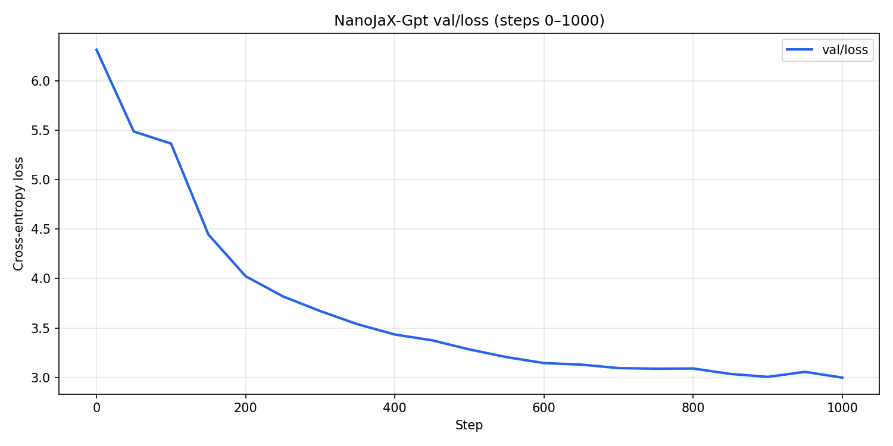

# NanoJaX-Gpt

A from-scratch GPT-style language model in **JAX / Flax / Optax**, structured like [NanoGPT](https://github.com/karpathy/nanoGPT): a flat repo with a few Python files at the root, hyperparameters in `config.py`, and scripts you run directly. Inspired by Karpathy's NanoGPT and Stanford CS336 Assignment 1.

Byte-level BPE tokenization, pre-norm Transformer blocks (RMSNorm, RoPE, SwiGLU), AdamW training with cosine warmup, and autoregressive sampling.


---

## Project structure

Like NanoGPT — everything lives at the repo root:

| Package | Purpose |
|---------|---------|
| `jax`, `jaxlib` | Array ops, `jit`, autodiff, devices (CPU/GPU/TPU) |
| `flax` | `nn.Module`, parameters, checkpoint serialization |
| `optax` | AdamW/SGD, LR schedules, gradient clipping |
| `numpy` | Token memmap dataset |
| `pyyaml` | Model/train configs |
| `msgpack` | Checkpoint payloads (via Flax) |
| `matplotlib` | Training loss plots (`scripts/plot_metrics.py`) |
---

## Dependencies

| Package | Purpose |
|---------|---------|
| `jax`, `jaxlib` | Arrays, `jit`, autodiff, CPU/GPU/TPU |
| `flax` | `nn.Module`, checkpoint serialization |
| `optax` | AdamW, LR schedules, grad clipping |
| `numpy` | Token memmap |
| `matplotlib` | Loss plots |

### Install

```bash
python -m venv .venv
source .venv/bin/activate   # Windows: .venv\Scripts\activate
pip install -r requirements.txt
```

**JAX on GPU:** follow the [JAX install guide](https://jax.readthedocs.io/en/latest/installation.html) for your platform. Apple Silicon usually gets Metal with `pip install jax`.

**Python:** 3.11+

---

## Dataset

Default corpus: `Data/input.txt` (Tiny Shakespeare).

```bash
mkdir -p Data
curl -L https://raw.githubusercontent.com/karpathy/char-rnn/master/data/tinyshakespeare/input.txt \
  -o Data/input.txt
```

If you wanna train model on bigger corpus. Here's few more examples.
```bash
cd data

wget https://huggingface.co/datasets/roneneldan/TinyStories/resolve/main/TinyStoriesV2-GPT4-train.txt
wget https://huggingface.co/datasets/roneneldan/TinyStories/resolve/main/TinyStoriesV2-GPT4-valid.txt

wget https://huggingface.co/datasets/stanford-cs336/owt-sample/resolve/main/owt_train.txt.gz
gunzip owt_train.txt.gz
wget https://huggingface.co/datasets/stanford-cs336/owt-sample/resolve/main/owt_valid.txt.gz
gunzip owt_valid.txt.gz

cd ..
```
---

## Quick start

All commands from the **repo root**:

```bash
# 1. Train BPE tokenizer (512 vocab by default)
python train_tokenizer.py

# 2. Encode text to token cache
python prepare_data.py

# 3. Train
python train.py

# 4. Sample
python sample.py --checkpoint out/run_YYYYMMDD_HHMMSS/best --prompt "ROMEO:"

# 5. Plot loss
python plot_metrics.py --metrics out/run_YYYYMMDD_HHMMSS/metrics.json
```

Checkpoints land in `out/run_*/best` and `out/run_*/last`. Each run saves a copy of `config.py` and `metrics.json`.

### Example val/loss curve

Fast preset on Tiny Shakespeare (`python train_fast.py`), steps 0–1000:



To embed any image in Markdown, use a **relative path** from the repo root:

```markdown

```

Optional caption or link form:

```markdown

<!-- or -->
[](docs/images/val_loss_fast_1000.png)
```

Regenerate the plot after training:

```bash
python plot_metrics.py \
  --metrics out/fast/run_YYYYMMDD_HHMMSS/metrics.json \
  --output docs/images/val_loss_fast_1000.png \
  --val-only --max-step 1000
```

---

## Configuration

All hyperparameters are plain Python variables in [`config.py`](config.py). Defaults match NanoGPT Shakespeare training:

```python
block_size = 1024
batch_size = 32
vocab_size = 512
n_layer = 12
n_head = 12
n_embd = 768
dropout = 0.0
bias = True
learning_rate = 6e-4
max_iters = 5000
```

Vocab is padded to the nearest multiple of 64 for efficiency. Change any value, then re-run the pipeline.

For a quick smoke test, lower `max_iters`, `n_layer`, and `block_size` in `config.py`.

---

## Sampling

```bash
python sample.py \
  --checkpoint out/run_YYYYMMDD_HHMMSS/best \
  --prompt "ROMEO:" \
  --max-new-tokens 200 \
  --temperature 0.8 \
  --top-k 40
```

| Flag | Default | Meaning |
|------|---------|---------|
| `--checkpoint` | (required) | Dir with `state.msgpack` |
| `--prompt` | `""` | Text prefix |
| `--tokenizer` | `out/tokenizer.json` | Must match training |
| `--max-new-tokens` | `100` | Tokens to generate |
| `--block-size` | from `config.py` | Context window |
| `--temperature` | `1.0` | Sampling temperature |
| `--top-k` | `40` | Top-k filtering (`0` = off) |

Use the **`best`** checkpoint (lowest val loss) for generation.

---

## Tests

```bash
pytest
```

---

## Troubleshooting

**`ModuleNotFoundError: jax`** — run `pip install -r requirements.txt` from repo root.

**Tokenizer / tokens not found** — run `train_tokenizer.py` then `prepare_data.py` before `train.py`.

**BPE training slow** — large `vocab_size` on a big file can take a while. Start with `vocab_size = 512`.

**JAX OOM** — reduce `batch_size`, `n_embd`, `n_layer`, or `block_size` in `config.py`.

**Garbled samples** — train longer; 5000 steps on CPU takes time. Lower temperature (`0.5–0.8`) helps.

**Verify device:**

```python
import jax
print(jax.devices())
```

---

## License

MIT (see repository).
